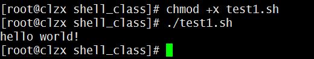
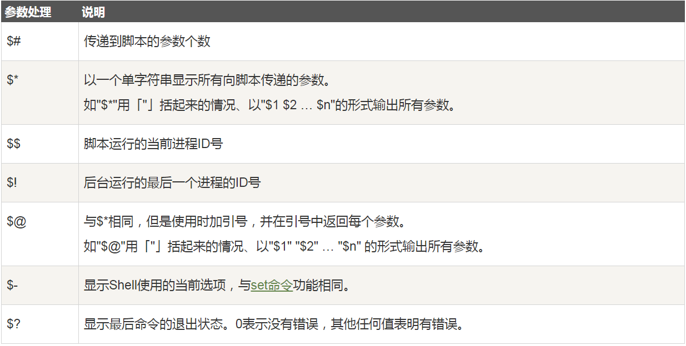
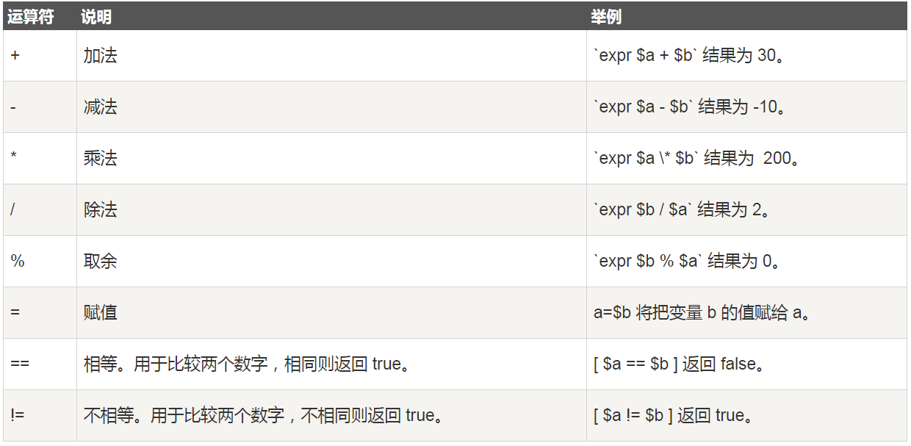
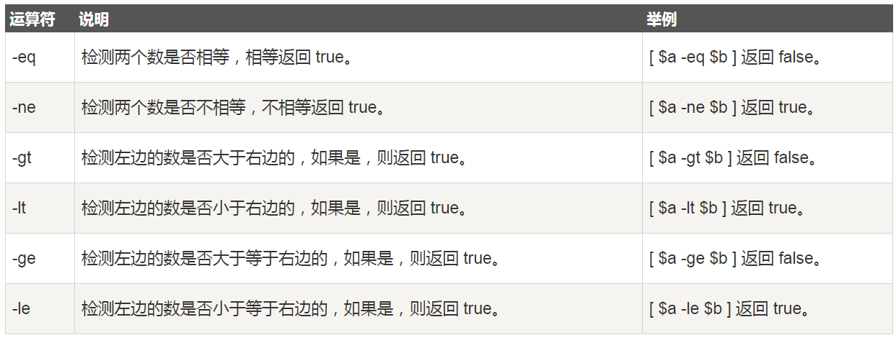
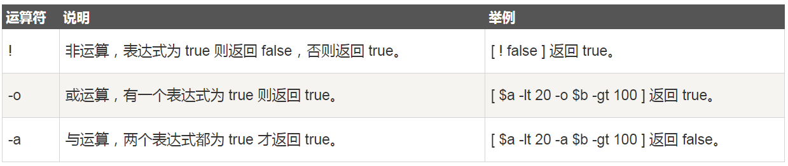
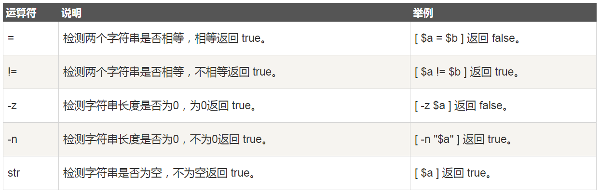
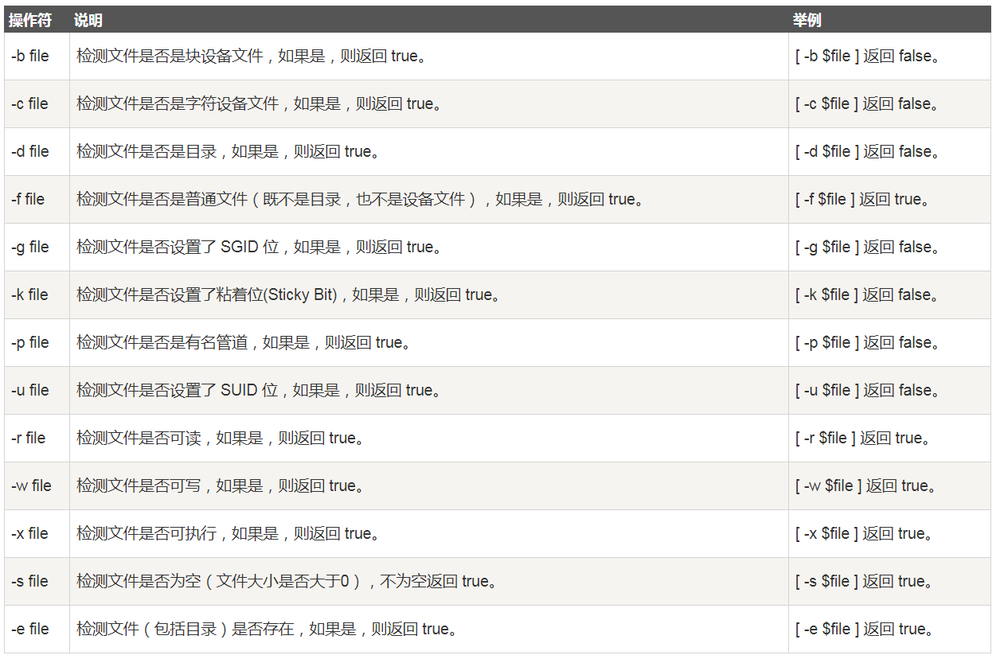
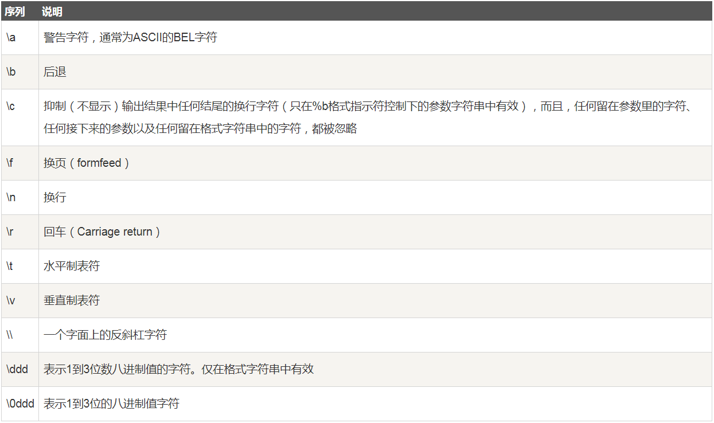
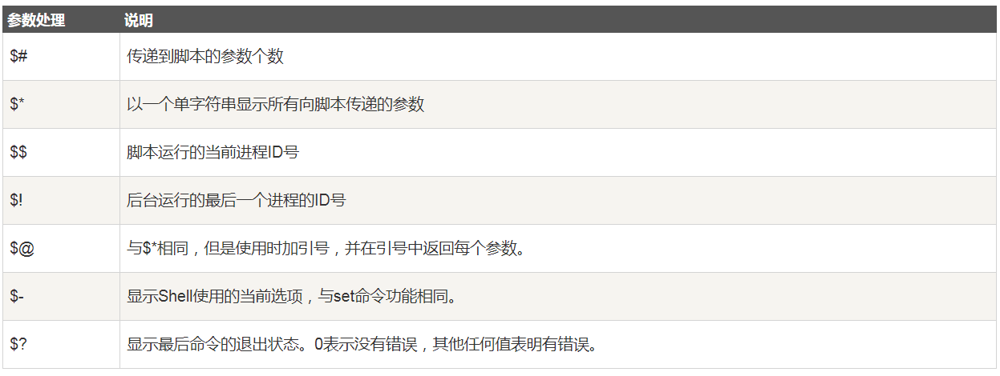
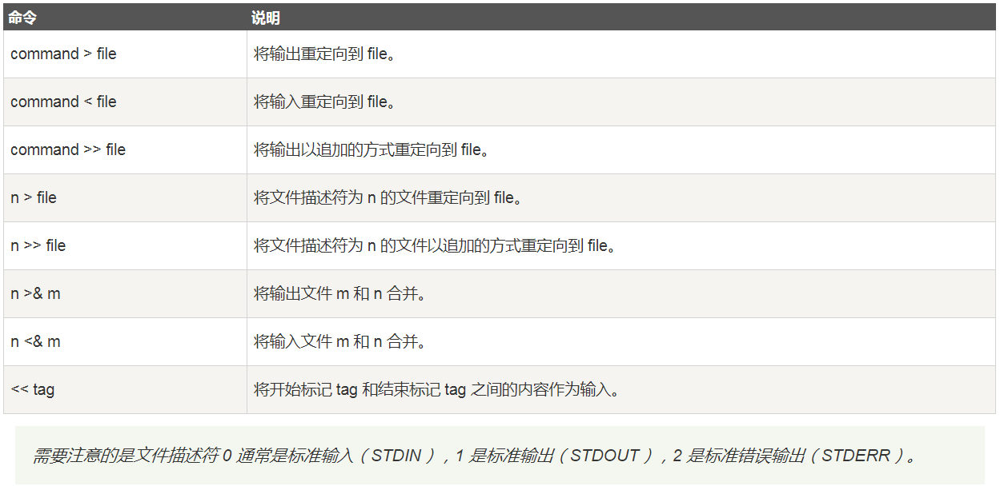

## Shell

------

### 1.shell环境

Shell 编程跟 java、php 编程一样，只要有一个能编写代码的文本编辑器和一个能解释执行的脚本解释器就可以了。

Linux 的 Shell 种类众多，常见的有：

+ Bourne Shell（/usr/bin/sh或/bin/sh）
+ Bourne Again Shell（/bin/bash）
+ C Shell（/usr/bin/csh）
+ K Shell（/usr/bin/ksh）
+ Shell for Root（/sbin/sh）

本教程关注的是 Bash，也就是 Bourne Again Shell，由于易用和免费，Bash 在日常工作中被广泛使用。同时，Bash 也是大多数Linux 系统默认的 Shell。

在一般情况下，人们并不区分 Bourne Shell 和 Bourne Again Shell，所以，像 #!/bin/sh，它同样也可以改为 #!/bin/bash。#!告诉系统其后路径所指定的程序即是解释此脚本文件的 Shell 程序。

**我的第一个Shell脚本**

```shell
#!/bin/bash
echo "Hello World !"
```
`#!`是一个约定的标记，它告诉系统这个脚本需要什么解释器来执行，即使用哪一种 Shell。
echo 命令用于向窗口输出文本。

**运行shell的两种方式**

1.将上面的代码保存为 test.sh，并 cd 到相应目录

```shell
    chmod +x ./test.sh  #使脚本具有执行权限
    ./test.sh  #执行脚本
```
注意，一定要写成 ./test.sh，而不是 test.sh，运行其它二进制的程序也一样，直接写 test.sh，linux 系统会去 PATH 里寻找有没有叫 test.sh 的，而只有 /bin, /sbin, /usr/bin，/usr/sbin 等在 PATH 里，你的当前目录通常不在 PATH 里，所以写成 test.sh 是会找不到命令的，要用 ./test.sh 告诉系统说，就在当前目录找。

2.这种运行方式是，直接运行解释器，其参数就是 shell 脚本的文件名，如：
   
```shell
    /bin/sh test.sh
    /bin/php test.php
```
这种方式运行的脚本，不需要在第一行指定解释器信息，写了也没用。

<div align=center>
 
</div>

------

### 2.shell变量

定义变量时，变量名不加美元符号（$，PHP语言中变量需要），如：

```shell
your_name="dataxujing"
```

注意，变量名和等号之间不能有空格，这可能和你熟悉的所有编程语言都不一样。同时，变量名的命名须遵循如下规则：

+ 命名只能使用英文字母，数字和下划线，首个字符不能以数字开头。
+ 中间不能有空格，可以使用下划线（_）。
+ 不能使用标点符号。
+  不能使用bash里的关键字（可用help命令查看保留关键字）。

    
除了显式地直接赋值，还可以用语句给变量赋值，如：

```shell
for file in `ls /etc`
或
for file in $(ls /etc)
```

以上语句将 /etc 下目录的文件名循环出来。

**使用变量** 

使用一个定义过的变量，只要在变量名前面加美元符号即可，如:

```shell
your_name="qinjx"
echo $your_name
echo ${your_name}
```

变量名外面的花括号是可选的，加不加都行，加花括号是为了帮助解释器识别变量的边界，比如下面这种情况：

```shell
for skill in Ada Coffe Action Java; do
    echo "I am good at ${skill}Script"
done
```
推荐给所有变量加上花括号，这是个好的编程习惯。

已定义的变量，可以被重新定义，如：
```shell
your_name="tom"
echo $your_name
your_name="alibaba"
echo $your_name
```

**只读变量**

使用 readonly 命令可以将变量定义为只读变量，只读变量的值不能被改变。

下面的例子尝试更改只读变量，结果报错：

```shell
#!/bin/bash
myUrl="http://www.google.com"
readonly myUrl
myUrl="http://www.runoob.com"
```

运行脚本，结果如下：

```shell
/bin/sh: NAME: This variable is read only.
```

**删除变量**

使用 unset 命令可以删除变量。语法：

```shell
unset variable_name
```

变量被删除后不能再次使用。unset 命令不能删除只读变量。


**shell字符串**

字符串是shell编程中最常用最有用的数据类型（除了数字和字符串，也没啥其它类型好用了），字符串可以用单引号，也可以用双引号，也可以不用引号。单双引号的区别跟PHP类似。

*单引号*
```shell
str='this is a string'
```
单引号字符串的限制：

+ 单引号里的任何字符都会原样输出，单引号字符串中的变量是无效的；
+ 单引号字串中不能出现单独一个的单引号（对单引号使用转义符后也不行），但可成对出现，作为字符串拼接使用。

*双引号*
```shell
your_name='runoob'
str="Hello, I know you are \"$your_name\"! \n"
echo -e $str
```

双引号的优点：

+ 双引号里可以有变量
+ 双引号里可以出现转义字符

**拼接字符串**

```shell
your_name="runoob"
# 使用双引号拼接
greeting="hello, "$your_name" !"
greeting_1="hello, ${your_name} !"
echo $greeting  $greeting_1
# 使用单引号拼接
greeting_2='hello, '$your_name' !'
greeting_3='hello, ${your_name} !'
echo $greeting_2  $greeting_3
```

输出结果为：

```
hello, runoob ! hello, runoob !
hello, runoob ! hello, ${your_name} !
```

**获取字符串长度**

```shell
string="abcd"
echo ${#string} #输出 4
```

**提取子字符串**

以下实例从字符串第 2 个字符开始截取 4 个字符：

```
string="runoob is a great site"
echo ${string:1:4} # 输出 unoo
```

**查找子字符串**

查找字符 i 或 o 的位置(哪个字母先出现就计算哪个)：

```
string="runoob is a great site"
echo `expr index "$string" io`  # 输出 4
```

### 3.shell 数组

bash支持一维数组（不支持多维数组），并且没有限定数组的大小。

类似于 C 语言，数组元素的下标由 0 开始编号。获取数组中的元素要利用下标，下标可以是整数或算术表达式，其值应大于或等于 0。

*定义数组*

在 Shell 中，用括号来表示数组，数组元素用"空格"符号分割开。定义数组的一般形式为：

```
数组名=(值1 值2 ... 值n)
```

例如：

```
array_name=(value0 value1 value2 value3)
或者

array_name=(
value0
value1
value2
value3
)
```
还可以单独定义数组的各个分量：
```
array_name[0]=value0
array_name[1]=value1
array_name[n]=valuen
```
可以不使用连续的下标，而且下标的范围没有限制。

*读取数组*

读取数组元素值的一般格式是：

```
${数组名[下标]}
```

使用 @ 符号可以获取数组中的所有元素，例如：

```
echo ${array_name[@]}
```

*获取数组的长度*

获取数组长度的方法与获取字符串长度的方法相同，例如：

```
# 取得数组元素的个数
length=${#array_name[@]}
# 或者
length=${#array_name[*]}
# 取得数组单个元素的长度
lengthn=${#array_name[n]}
```

**Shell 注释**

以 # 开头的行就是注释，会被解释器忽略。

通过每一行加一个 # 号设置多行注释，像这样：

```
##### 用户配置区 开始 #####
#
#
# 这里可以添加脚本描述信息
# 
#
##### 用户配置区 结束  #####
```

*多行注释*

多行注释还可以使用以下格式：

```
:<<EOF
注释内容...
注释内容...
注释内容...
EOF
```

EOF 也可以使用其他符号:
```
:<<'
注释内容...
注释内容...
注释内容...
'

:<<!
注释内容...
注释内容...
注释内容...
!
```

### 4.shell传递参数

我们可以在执行 Shell 脚本时，向脚本传递参数，脚本内获取参数的格式为：$n。n 代表一个数字，1 为执行脚本的第一个参数，2 为执行脚本的第二个参数，以此类推……

Exanple:

以下实例我们向脚本传递三个参数，并分别输出，其中 $0 为执行的文件名：

```
#!/bin/bash
# author:菜鸟教程
# url:www.runoob.com

echo "Shell 传递参数实例！";
echo "执行的文件名：$0";
echo "第一个参数为：$1";
echo "第二个参数为：$2";
echo "第三个参数为：$3";
```

为脚本设置可执行权限，并执行脚本，输出结果如下所示：

```
$ chmod +x test.sh 
$ ./test.sh 1 2 3
Shell 传递参数实例！
执行的文件名：./test.sh
第一个参数为：1
第二个参数为：2
第三个参数为：3
```

另外，还有几个特殊字符用来处理参数：

<div align=center>
 
</div>


```
#!/bin/bash
# author:菜鸟教程
# url:www.runoob.com

echo "Shell 传递参数实例！";
echo "第一个参数为：$1";

echo "参数个数为：$#";
echo "传递的参数作为一个字符串显示：$*";

```

执行脚本，输出结果如下所示：
```
$ chmod +x test.sh 
$ ./test.sh 1 2 3
Shell 传递参数实例！
第一个参数为：1
参数个数为：3
传递的参数作为一个字符串显示：1 2 3
```


### 5.shell基本运算符

Shell 和其他编程语言一样，支持多种运算符，包括：

+ 算数运算符
+ 关系运算符
+ 布尔运算符
+ 字符串运算符
+ 文件测试运算符

原生bash不支持简单的数学运算，但是可以通过其他命令来实现，例如 awk 和 expr，expr 最常用。

expr 是一款表达式计算工具，使用它能完成表达式的求值操作。

例如，两个数相加(注意使用的是反引号 ` 而不是单引号 ')：

```
#!/bin/bash

val=`expr 2 + 2`
echo "两数之和为 : $val"
```

执行脚本，输出结果如下所示：

```
两数之和为 : 4
```

两点注意：

+ 表达式和运算符之间要有空格，例如 2+2 是不对的，必须写成 2 + 2，这与我们熟悉的大多数编程语言不一样。
+ 完整的表达式要被 '` ` '包含，注意这个字符不是常用的单引号，在 Esc 键下边。

*算术运算符*

下表列出了常用的算术运算符，假定变量 a 为 10，变量 b 为 20：

<div align=center>
 
</div>

注意：条件表达式要放在方括号之间，并且要有空格，例如: [$a==$b] 是错误的，必须写成 [ $a == $b ]。

*实例*

算术运算符实例如下：

```
#!/bin/bash
# author:菜鸟教程
# url:www.runoob.com

a=10
b=20

val=`expr $a + $b`
echo "a + b : $val"

val=`expr $a - $b`
echo "a - b : $val"

val=`expr $a \* $b`
echo "a * b : $val"

val=`expr $b / $a`
echo "b / a : $val"

val=`expr $b % $a`
echo "b % a : $val"

if [ $a == $b ]
then
   echo "a 等于 b"
fi
if [ $a != $b ]
then
   echo "a 不等于 b"
fi
```

执行脚本，输出结果如下所示：

```
**a + b : 30
a - b : -10
a * b : 200
b / a : 2
b % a : 0
a 不等于 b
```

注意：

+ 乘号(*)前边必须加反斜杠(\)才能实现乘法运算；
+ if...then...fi 是条件语句，后续将会讲解。
+ 在 MAC 中 shell 的 expr 语法是：$((表达式))，此处表达式中的 "*" 不需要转义符号 "\" 。


*关系运算符*

关系运算符只支持数字，不支持字符串，除非字符串的值是数字。

下表列出了常用的关系运算符，假定变量 a 为 10，变量 b 为 20：

<div align=center>
 
</div>

*实例*

关系运算符实例如下：

```
#!/bin/bash
# author:菜鸟教程
# url:www.runoob.com

a=10
b=20

if [ $a -eq $b ]
then
   echo "$a -eq $b : a 等于 b"
else
   echo "$a -eq $b: a 不等于 b"
fi
if [ $a -ne $b ]
then
   echo "$a -ne $b: a 不等于 b"
else
   echo "$a -ne $b : a 等于 b"
fi
if [ $a -gt $b ]
then
   echo "$a -gt $b: a 大于 b"
else
   echo "$a -gt $b: a 不大于 b"
fi
if [ $a -lt $b ]
then
   echo "$a -lt $b: a 小于 b"
else
   echo "$a -lt $b: a 不小于 b"
fi
if [ $a -ge $b ]
then
   echo "$a -ge $b: a 大于或等于 b"
else
   echo "$a -ge $b: a 小于 b"
fi
if [ $a -le $b ]
then
   echo "$a -le $b: a 小于或等于 b"
else
   echo "$a -le $b: a 大于 b"
fi

```

执行脚本，输出结果如下所示：
```
10 -eq 20: a 不等于 b
10 -ne 20: a 不等于 b
10 -gt 20: a 不大于 b
10 -lt 20: a 小于 b
10 -ge 20: a 小于 b
10 -le 20: a 小于或等于 b
```

*布尔运算符*

下表列出了常用的布尔运算符，假定变量 a 为 10，变量 b 为 20：

<div align=center>
 
</div>

*实例*

布尔运算符实例如下：

```
#!/bin/bash
# author:菜鸟教程
# url:www.runoob.com

a=10
b=20

if [ $a != $b ]
then
   echo "$a != $b : a 不等于 b"
else
   echo "$a != $b: a 等于 b"
fi
if [ $a -lt 100 -a $b -gt 15 ]
then
   echo "$a 小于 100 且 $b 大于 15 : 返回 true"
else
   echo "$a 小于 100 且 $b 大于 15 : 返回 false"
fi
if [ $a -lt 100 -o $b -gt 100 ]
then
   echo "$a 小于 100 或 $b 大于 100 : 返回 true"
else
   echo "$a 小于 100 或 $b 大于 100 : 返回 false"
fi
if [ $a -lt 5 -o $b -gt 100 ]
then
   echo "$a 小于 5 或 $b 大于 100 : 返回 true"
else
   echo "$a 小于 5 或 $b 大于 100 : 返回 false"
fi
```

执行脚本，输出结果如下所示：
```
10 != 20 : a 不等于 b
10 小于 100 且 20 大于 15 : 返回 true
10 小于 100 或 20 大于 100 : 返回 true
10 小于 5 或 20 大于 100 : 返回 false
```

*逻辑运算符*

以下介绍 Shell 的逻辑运算符，假定变量 a 为 10，变量 b 为 20:

<div align=center>
 
</div>

*实例*

逻辑运算符实例如下：

```
#!/bin/bash
# author:菜鸟教程
# url:www.runoob.com

a=10
b=20

if [[ $a -lt 100 && $b -gt 100 ]]
then
   echo "返回 true"
else
   echo "返回 false"
fi

if [[ $a -lt 100 || $b -gt 100 ]]
then
   echo "返回 true"
else
   echo "返回 false"
fi
```

执行脚本，输出结果如下所示：

```
返回 false
返回 true
```

*字符串运算符*

下表列出了常用的字符串运算符，假定变量 a 为 "abc"，变量 b 为 "efg"：

<div align=center>
 
</div>


实例
字符串运算符实例如下：
```
#!/bin/bash
# author:菜鸟教程
# url:www.runoob.com

a="abc"
b="efg"

if [ $a = $b ]
then
   echo "$a = $b : a 等于 b"
else
   echo "$a = $b: a 不等于 b"
fi
if [ $a != $b ]
then
   echo "$a != $b : a 不等于 b"
else
   echo "$a != $b: a 等于 b"
fi
if [ -z $a ]
then
   echo "-z $a : 字符串长度为 0"
else
   echo "-z $a : 字符串长度不为 0"
fi
if [ -n "$a" ]
then
   echo "-n $a : 字符串长度不为 0"
else
   echo "-n $a : 字符串长度为 0"
fi
if [ $a ]
then
   echo "$a : 字符串不为空"
else
   echo "$a : 字符串为空"
fi
```
执行脚本，输出结果如下所示：
```
abc = efg: a 不等于 b
abc != efg : a 不等于 b
-z abc : 字符串长度不为 0
-n abc : 字符串长度不为 0
abc : 字符串不为空
```

*文件测试运算符*

文件测试运算符用于检测 Unix 文件的各种属性。

属性检测描述如下：

<div align=center>
 
</div>

实例
变量 file 表示文件"/var/www/runoob/test.sh"，它的大小为100字节，具有 rwx 权限。下面的代码，将检测该文件的各种属性：

```
#!/bin/bash
# author:菜鸟教程
# url:www.runoob.com

file="/var/www/runoob/test.sh"
if [ -r $file ]
then
   echo "文件可读"
else
   echo "文件不可读"
fi
if [ -w $file ]
then
   echo "文件可写"
else
   echo "文件不可写"
fi
if [ -x $file ]
then
   echo "文件可执行"
else
   echo "文件不可执行"
fi
if [ -f $file ]
then
   echo "文件为普通文件"
else
   echo "文件为特殊文件"
fi
if [ -d $file ]
then
   echo "文件是个目录"
else
   echo "文件不是个目录"
fi
if [ -s $file ]
then
   echo "文件不为空"
else
   echo "文件为空"
fi
if [ -e $file ]
then
   echo "文件存在"
else
   echo "文件不存在"
fi
```
执行脚本，输出结果如下所示：
```
文件可读
文件可写
文件可执行
文件为普通文件
文件不是个目录
文件不为空
文件存在
```


### 6.shell echo命令

Shell 的 echo 指令与 PHP 的 echo 指令类似，都是用于字符串的输出。命令格式：

```
echo string
```

您可以使用echo实现更复杂的输出格式控制。

*1.显示普通字符串:*

```
echo "It is a test"
```

这里的双引号完全可以省略，以下命令与上面实例效果一致：

```
echo It is a test
```

*2.显示转义字符*

```
echo "\"It is a test\""
```

结果将是:
```
"It is a test"
```

*3.显示变量*

read 命令从标准输入中读取一行,并把输入行的每个字段的值指定给 shell 变量

```
#!/bin/sh
read name 
echo "$name It is a test"
```

以上代码保存为 test.sh，name 接收标准输入的变量，结果将是:

```
[root@www ~]# sh test.sh
OK                     #标准输入
OK It is a test        #输出
```

*4.显示换行*

```
echo -e "OK! \n" # -e 开启转义
echo "It is a test"
```

输出结果：

```
OK!

It is a test
```

*5.显示不换行*

```
#!/bin/sh
echo -e "OK! \c" # -e 开启转义 \c 不换行
echo "It is a test"
```

输出结果：
```
OK! It is a test
```

*6.显示结果定向至文件*

```
echo "It is a test" > myfile
```

*7.原样输出字符串，不进行转义或取变量(用单引号)*

```
echo '$name\"'
输出结果：

$name\"
```

*8.显示命令执行结果*
```
echo `date`
```

注意： 这里使用的是反引号 `, 而不是单引号 '。

结果将显示当前日期
```
Thu Jul 24 10:08:46 CST 2014
```

### 7.shell printf 命令

printf 使用引用文本或空格分隔的参数，外面可以在 printf 中使用格式化字符串，还可以制定字符串的宽度、左右对齐方式等。默认 printf 不会像 echo 自动添加换行符，我们可以手动添加 \n。

printf 命令的语法：

```
printf  format-string  [arguments...]
```

参数说明：

+ format-string: 为格式控制字符串
+ arguments: 为参数列表。

```
$ echo "Hello, Shell"
Hello, Shell
$ printf "Hello, Shell\n"
Hello, Shell
$
```

接下来,我来用一个脚本来体现printf的强大功能：

```
#!/bin/bash
# author:菜鸟教程
# url:www.runoob.com
 
printf "%-10s %-8s %-4s\n" 姓名 性别 体重kg  
printf "%-10s %-8s %-4.2f\n" 郭靖 男 66.1234 
printf "%-10s %-8s %-4.2f\n" 杨过 男 48.6543 
printf "%-10s %-8s %-4.2f\n" 郭芙 女 47.9876 
```

执行脚本，输出结果如下所示：

```
姓名     性别   体重kg
郭靖     男      66.12
杨过     男      48.65
郭芙     女      47.99

```

%s %c %d %f都是格式替代符

%-10s 指一个宽度为10个字符（-表示左对齐，没有则表示右对齐），任何字符都会被显示在10个字符宽的字符内，如果不足则自动以空格填充，超过也会将内容全部显示出来。

%-4.2f 指格式化为小数，其中.2指保留2位小数。

更多实例：

```
#!/bin/bash
# author:菜鸟教程
# url:www.runoob.com
 
# format-string为双引号
printf "%d %s\n" 1 "abc"

# 单引号与双引号效果一样 
printf '%d %s\n' 1 "abc" 

# 没有引号也可以输出
printf %s abcdef

# 格式只指定了一个参数，但多出的参数仍然会按照该格式输出，format-string 被重用
printf %s abc def

printf "%s\n" abc def

printf "%s %s %s\n" a b c d e f g h i j

# 如果没有 arguments，那么 %s 用NULL代替，%d 用 0 代替
printf "%s and %d \n" 

```

执行脚本，输出结果如下所示：

```
1 abc
1 abc
abcdefabcdefabc
def
a b c
d e f
g h i
j  
 and 0

```

<div align=center>
 
</div>

```
$ printf "a string, no processing:<%s>\n" "A\nB"
a string, no processing:<A\nB>

$ printf "a string, no processing:<%b>\n" "A\nB"
a string, no processing:<A
B>

$ printf "www.runoob.com \a"
www.runoob.com $                  #不换行
```

### 8.shell test 命令

shell中的 test 命令用于检查某个条件是否成立，它可以进行数值、字符和文件三个方面的测试。
详见：<http://www.runoob.com/linux/linux-shell-test.html>

### 9.shell 流程控制

和Java、PHP等语言不一样，sh的流程控制不可为空，如(以下为PHP流程控制写法)：

```
<?php
if (isset($_GET["q"])) {
    search(q);
}
else {
    // 不做任何事情
}
```

在sh/bash里可不能这么写，如果else分支没有语句执行，就不要写这个else。

**if**

if 语句语法格式：

```
if condition
then
    command1 
    command2
    ...
    commandN 
fi
```

写成一行（适用于终端命令提示符）：

```
if [ $(ps -ef | grep -c "ssh") -gt 1 ]; then echo "true"; fi
```
末尾的fi就是if倒过来拼写，后面还会遇到类似的。

**if else**

if else 语法格式：

```
if condition
then
    command1 
    command2
    ...
    commandN
else
    command
fi
```

**if else-if else**

if else-if else 语法格式：

```
if condition1
then
    command1
elif condition2 
then 
    command2
else
    commandN
fi
```

以下实例判断两个变量是否相等：

```
a=10
b=20
if [ $a == $b ]
then
   echo "a 等于 b"
elif [ $a -gt $b ]
then
   echo "a 大于 b"
elif [ $a -lt $b ]
then
   echo "a 小于 b"
else
   echo "没有符合的条件"
fi
```

输出结果：

```
a 小于 b
```

if else语句经常与test命令结合使用，如下所示：

```
num1=$[2*3]
num2=$[1+5]
if test $[num1] -eq $[num2]
then
    echo '两个数字相等!'
else
    echo '两个数字不相等!'
fi
```

输出结果：
```
两个数字相等!
```

**for 循环**

与其他编程语言类似，Shell支持for循环。

for循环一般格式为：

```
for var in item1 item2 ... itemN
do
    command1
    command2
    ...
    commandN
done
```

写成一行：

```
for var in item1 item2 ... itemN; do command1; command2… done;
```

```
for loop in 1 2 3 4 5
do
    echo "The value is: $loop"
done

```

输出结果：
```
The value is: 1
The value is: 2
The value is: 3
The value is: 4
The value is: 5
```

顺序输出字符串中的字符：

```
for str in 'This is a string'
do
    echo $str
done
输出结果：

This is a string
```

**while语句**

while循环用于不断执行一系列命令，也用于从输入文件中读取数据；命令通常为测试条件。其格式为：

```
while condition
do
    command
done
```

```
#!/bin/bash
int=1
while(( $int<=5 ))
do
    echo $int
    let "int++"
done
运行脚本，输出：

1
2
3
4
5
```

```
echo '按下 <CTRL-D> 退出'
echo -n '输入你最喜欢的网站名: '
while read FILM
do
    echo "是的！$FILM 是一个好网站"
done

行脚本，输出类似下面：

按下 <CTRL-D> 退出
输入你最喜欢的网站名:菜鸟教程
是的！菜鸟教程 是一个好网站
```

**until 循环**

until 循环执行一系列命令直至条件为 true 时停止。

until 循环与 while 循环在处理方式上刚好相反。

一般 while 循环优于 until 循环，但在某些时候—也只是极少数情况下，until 循环更加有用。

until 语法格式:

```
until condition
do
    command
done
```

```
#!/bin/bash

a=0

until [ ! $a -lt 10 ]
do
   echo $a
   a=`expr $a + 1`
done
运行结果：

输出结果为：

0
1
2
3
4
5
6
7
8
9
```

**case**

Shell case语句为多选择语句。可以用case语句匹配一个值与一个模式，如果匹配成功，执行相匹配的命令。case语句格式如下:

```
case 值 in
模式1)
    command1
    command2
    ...
    commandN
    ;;
模式2）
    command1
    command2
    ...
    commandN
    ;;
esac
```

```
echo '输入 1 到 4 之间的数字:'
echo '你输入的数字为:'
read aNum
case $aNum in
    1)  echo '你选择了 1'
    ;;
    2)  echo '你选择了 2'
    ;;
    3)  echo '你选择了 3'
    ;;
    4)  echo '你选择了 4'
    ;;
    *)  echo '你没有输入 1 到 4 之间的数字'
    ;;
esac
输入不同的内容，会有不同的结果，例如：

输入 1 到 4 之间的数字:
你输入的数字为:
3
你选择了 3
```

**跳出循环**

*break*

break命令允许跳出所有循环（终止执行后面的所有循环）。

*continue*

continue命令与break命令类似，只有一点差别，它不会跳出所有循环，仅仅跳出当前循环。

*esac*

case的语法和C family语言差别很大，它需要一个esac（就是case反过来）作为结束标记，每个case分支用右圆括号，用两个分号表示break。

### 10.shell 函数

linux shell 可以用户定义函数，然后在shell脚本中可以随便调用。

shell中函数的定义格式如下：

```
[ function ] funname [()]

{

    action;

    [return int;]

}
```

说明：

+ 1、可以带function fun() 定义，也可以直接fun() 定义,不带任何参数。
+ 2、参数返回，可以显示加：return 返回，如果不加，将以最后一条命令运行结果，作为返回值。 return后跟数值n(0-255)

下面的例子定义了一个函数并进行调用：

```
#!/bin/bash
# author:菜鸟教程
# url:www.runoob.com

demoFun(){
    echo "这是我的第一个 shell 函数!"
}
echo "-----函数开始执行-----"
demoFun
echo "-----函数执行完毕-----"

```

输出结果：
```
-----函数开始执行-----
这是我的第一个 shell 函数!
-----函数执行完毕-----
```

下面定义一个带有return语句的函数：

```
#!/bin/bash
# author:菜鸟教程
# url:www.runoob.com

funWithReturn(){
    echo "这个函数会对输入的两个数字进行相加运算..."
    echo "输入第一个数字: "
    read aNum
    echo "输入第二个数字: "
    read anotherNum
    echo "两个数字分别为 $aNum 和 $anotherNum !"
    return $(($aNum+$anotherNum))
}
funWithReturn
echo "输入的两个数字之和为 $? !"
```

```
输出类似下面：

这个函数会对输入的两个数字进行相加运算...
输入第一个数字: 
1
输入第二个数字: 
2
两个数字分别为 1 和 2 !
输入的两个数字之和为 3 !
```

函数返回值在调用该函数后通过 $? 来获得。

注意：所有函数在使用前必须定义。这意味着必须将函数放在脚本开始部分，直至shell解释器首次发现它时，才可以使用。调用函数仅使用其函数名即可。


** 函数参数**

在Shell中，调用函数时可以向其传递参数。在函数体内部，通过 $n 的形式来获取参数的值，例如，$1表示第一个参数，$2表示第二个参数...

带参数的函数示例：

```
#!/bin/bash
# author:菜鸟教程
# url:www.runoob.com

funWithParam(){
    echo "第一个参数为 $1 !"
    echo "第二个参数为 $2 !"
    echo "第十个参数为 $10 !"
    echo "第十个参数为 ${10} !"
    echo "第十一个参数为 ${11} !"
    echo "参数总数有 $# 个!"
    echo "作为一个字符串输出所有参数 $* !"
}
funWithParam 1 2 3 4 5 6 7 8 9 34 73
```

```
输出结果：

第一个参数为 1 !
第二个参数为 2 !
第十个参数为 10 !
第十个参数为 34 !
第十一个参数为 73 !
参数总数有 11 个!
作为一个字符串输出所有参数 1 2 3 4 5 6 7 8 9 34 73 !
```

注意，$10 不能获取第十个参数，获取第十个参数需要${10}。当n>=10时，需要使用${n}来获取参数。

另外，还有几个特殊字符用来处理参数：

<div align=center>
 
</div>

### 11.shell 输入/输出重定向

重定向命令列表如下：

<div align=center>
 
</div>


### 12.shell 文件包含

和其他语言一样，Shell 也可以包含外部脚本。这样可以很方便的封装一些公用的代码作为一个独立的文件。

Shell 文件包含的语法格式如下：

```
. filename   # 注意点号(.)和文件名中间有一空格

或

source filename
```

**实例**

创建两个 shell 脚本文件。

test1.sh 代码如下：
```
#!/bin/bash
# author:菜鸟教程
# url:www.runoob.com

url="http://www.runoob.com"
```
test2.sh 代码如下：
```
#!/bin/bash
# author:菜鸟教程
# url:www.runoob.com

#使用 . 号来引用test1.sh 文件
. ./test1.sh

# 或者使用以下包含文件代码
# source ./test1.sh

echo "菜鸟教程官网地址：$url"
```

接下来，我们为 test2.sh 添加可执行权限并执行：

```
$ chmod +x test2.sh 
$ ./test2.sh 
菜鸟教程官网地址：http://www.runoob.com
```
>注：被包含的文件 test1.sh 不需要可执行权限。